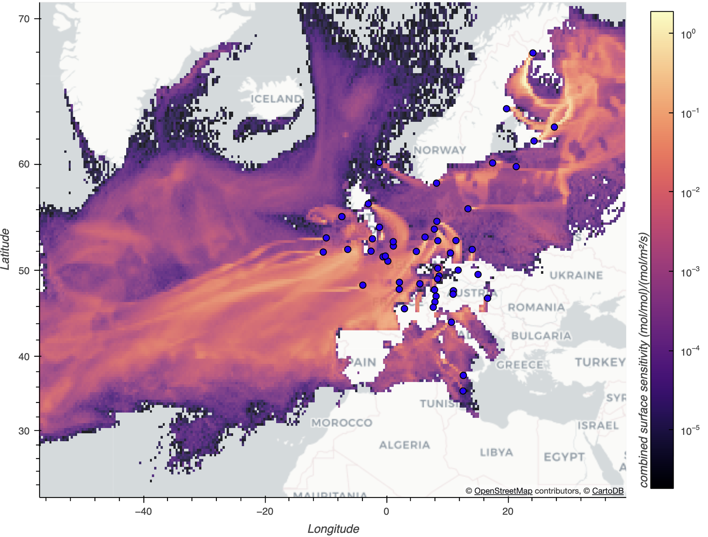

# GLIDE — GPU-accelerated Lagrangian Inversion & Dispersion Engine

A backward-in-time Lagrangian Particle Dispersion Model (LPDM) for trace gas
footprints, written in PyTorch.

**This model is a work in progress, shared for input from the research community. Do not use for production purposes.**


*GLIDE 5-day integrated footprints for ICOS tall-tower sites in Europe, 20th January 2024. The overall run batched 48 hours x 56 sites (2688 footprints), which took about 25 minutes on a single NVIDIA GH200 Grace Hopper node.*

## Purpose

GLIDE was built to answer a specific question: can a backward LPDM be made
*scalable* and *flexible* by rethinking its two traditional bottlenecks — I/O and
single-threaded CPU physics?

- **ARCO Zarr I/O.** Instead of reading whole NetCDF/GRIB met files, GLIDE streams
  [analysis-ready, cloud-optimised (ARCO)](https://www.frontiersin.org/journals/climate/articles/10.3389/fclim.2021.782909/full) [ERA5](https://cloud.google.com/storage/docs/public-datasets/era5)
  directly from a Zarr store, fetching only the chunks a run actually needs. The
  chunked layout means a regional, time-bounded run reads a small fraction of the
  archive rather than paging through monolithic files.
- **GPU physics.** The hot path — `grid_sample` interpolation of the wind/turbulence
  fields plus the elementwise Ornstein–Uhlenbeck turbulence step — is exactly the
  kind of dense, data-parallel work a GPU accelerates. The whole engine is
  device-agnostic (CUDA / MPS / CPU) and the per-step physics can be captured as a
  CUDA graph via `torch.compile`.

The ultimate aim is a model that is **more scalable and more flexible** than existing
CPU / NetCDF / GRIB-based LPDMs: able to launch large multi-site networks in a single
run, grow naturally onto larger accelerators, and adapt to new release geometries
(in-situ towers today; column and satellite releases on the roadmap).

> **Status:** research code under active development. The core backward model,
> Hanna (1982) turbulence, reduced-Emanuel convection, multi-site releases, and
> streaming Zarr output are implemented and tested, **but the physics has not been fully validated. I would NOT recommend using for production purposes at this stage.** See [Next Steps](#next-steps)
> for what's still ahead.

## Project Layout

| Path | Purpose |
| --- | --- |
| `src/lpdm/main.py` | Orchestrator + thin CLI entrypoint. |
| `src/lpdm/config.py` | Pydantic run-config schema (loaded from YAML). |
| `src/lpdm/met_reader.py` | ARCO ERA5 Zarr meteorology reader + met-window caching/prefetch. |
| `src/lpdm/gpu_engine.py` | Core GPU advection, coordinate transforms, field interpolation. |
| `src/lpdm/turbulence/` | Turbulence schemes (Hanna 1982) behind a common interface. |
| `src/lpdm/convection/` | Convective transport (reduced Emanuel) behind a common interface. |
| `src/lpdm/release_generator.py` | Particle release generators (point, periodic, multi-site). |
| `src/lpdm/footprint_gridder.py` | Accumulates particle residence time onto the output grid. |
| `src/lpdm/output_writer.py` | Streaming Zarr footprint + Parquet endpoint/diagnostic writers. |
| `src/lpdm/comparison.py` | STILT-style footprint conversion for validation against other LPDMs. |
| `configs/` | Example YAML run configs (see below). |
| `scripts/` | Met-download helpers and SLURM run scripts. |
| `notebooks/` | Exploration and validation notebooks. |
| `docs/` | Physics specifications (turbulence, convection, LPDM core). |
| `tests/` | Physics unit tests and end-to-end runtime/config tests. |

## Quick Start

```bash
uv venv --python 3.11 .venv
source .venv/bin/activate
uv pip install -e .                  # core (simulation only)
# uv pip install -e ".[viz,dev]"     # add notebook plotting stack + pytest
.venv/bin/python -m lpdm.main --config configs/local_smoke_test.yaml
```

`uv` is recommended (and required ≥ 0.4.0 for the torch wheel pin used on GPU
hosts — see [GPU Run](#gpu-run-isambard-ai-gh200)). Plain `python -m venv` +
`pip install -e .` also works for CPU-only use.

The dependency surface is split into a small core (`numpy`, `torch`, `xarray`,
`zarr`, `pydantic`, …) and two optional extras:

- `[viz]` — `hvplot`, `geoviews`, `jupyter_bokeh`, `matplotlib`, `ipykernel`,
  `nbformat`, plus `h5netcdf`/`h5py` for the comparison notebooks. Pulls in
  `cartopy` (C-extension heavy); if no binary wheel exists for your
  cpython / OS / arch you'll need `python3-dev` and `libgeos-dev` (or your
  distro's equivalent). Skip on headless compute nodes.
- `[dev]` — `pytest`.

### One-command bootstrap

`scripts/setup.sh` wraps the above and creates the venv with the right extras:

```bash
chmod +x scripts/setup.sh
./scripts/setup.sh --run-tests              # core + dev (pytest)
./scripts/setup.sh --with-viz --run-tests   # full notebook workstation
```

It uses `uv` when available (falling back to `venv + pip`), targets Python 3.11
by default (override with `--python`), and runs the physics tests when
`--run-tests` is passed.

## Configs and the release schema

Runs are driven by YAML; the schema is defined and validated in
[src/lpdm/config.py](src/lpdm/config.py). The CLI is intentionally tiny —
`--config <path>` plus `--device`, `--output-uri`, and `--start-time` overrides;
everything else lives in the YAML.

Example configs ship as a ladder from "no external data" to "full network":

| Config | What it runs |
| --- | --- |
| `local_smoke_test.yaml` | 3 h backward run against the small local `data/sample_met.zarr` — no remote data needed. |
| `smoke_mhd_single_release.yaml` | A single Mace Head release with full physics; quick GPU-path smoke test before a big run. |
| `example_mhd_january.yaml` | Single `point` release on the FLEXPART-aligned grid, with 24 hourly time-ago bins. |
| `example_mhd_january_periodic.yaml` | Hourly Mace Head releases over January 2024 in one process → a single 5-D `footprints.zarr`. |
| `example_multisite_january.yaml` | Several sites released together (`multi_point_periodic`). |

The full validation-network config (all sites × N hourly releases) is **generated
on demand** — it's large and machine-produced, so it isn't checked in:

```bash
python scripts/make_multisite_config.py --n-releases 48 -o configs/multisite_validation_48h.yaml
```

The `release` block is a discriminated union on `kind`:

- `point` — single release.
- `periodic_point` — `n_releases` evenly-spaced releases from one site.
- `point_schedule` — explicit `times: list[datetime]` from one site.
- `multi_point_periodic` — `n_releases` evenly-spaced releases from **multiple
  sites simultaneously**. Sites share one release schedule, so they share met
  windows: each met fetch (and the per-window convection matrix, field build, and
  per-step overhead) is paid once for all sites rather than once per site. This is
  the efficient way to grow a run across a network of stations.

All variants produce the same output with a flat `release` axis (one entry per
site × time) carrying `release_time`, `release_lon`, `release_lat`,
`release_alt_agl_m`, and `site` coordinates. Recover a per-site cube with:

```python
fp["footprint"].set_index(release=["site", "release_time"]).unstack("release").sel(site="MHD")
```

`batch.max_releases_per_batch` controls how many releases are integrated together
in one engine pass (keep it a multiple of the site count for multi-site runs).

## GPU Run (Isambard AI GH200)

GLIDE's hot path runs unmodified on CUDA. The SLURM scripts in `scripts/` are
tuned for the Isambard AI Grace-Hopper nodes (aarch64, 4 × GH200 per node).

**One-time setup** (in an interactive session on a login node):

```bash
module load cudatoolkit/24.11_12.6   # provides CUDA 12.6 runtime + nvcc/ptxas
                                     # do NOT also load cuda/12.6 — they conflict
uv venv --python 3.11 .venv
uv pip install --python .venv/bin/python -e ".[dev]"
# torch is automatically pinned to the cu126 aarch64 wheel via the
# [tool.uv.index]/[tool.uv.sources] tables in pyproject.toml
# (requires uv >= 0.4.0 — run `uv self update` if the version is older)

# Sanity check — must print: True 12.6
.venv/bin/python -c "import torch; print(torch.cuda.is_available(), torch.version.cuda)"
```

**Submit a run:**

```bash
mkdir -p slurm_logs
# fill in --account and --partition in the script header first
sbatch scripts/run_periodic_cuda.slurm configs/example_mhd_january_periodic.yaml
sbatch scripts/run_periodic_cuda.slurm configs/example_multisite_january.yaml
# full validation network (generate it first — see "Configs" above):
#   python scripts/make_multisite_config.py -o configs/multisite_validation_48h.yaml
#   sbatch scripts/run_periodic_cuda.slurm configs/multisite_validation_48h.yaml
```

**Notes:**

- `pyproject.toml` (`[tool.uv.index]` + `[tool.uv.sources]`) pins `torch` to the
  cu126 index on aarch64 via a platform marker; on x86 it falls back to PyPI (the
  CPU-only wheel for local dev). These tables are read only by uv — setuptools and
  pip ignore them. If the cluster moves to CUDA 12.8, update the `url`/`name` there
  and the module name in the SLURM script. Requires uv ≥ 0.4.0 (the config key is
  the singular `[[tool.uv.index]]`).
- `module load cudatoolkit/24.11_12.6` must be the sole CUDA module loaded — it
  supersedes the older `cuda/12.6` module and the two conflict. The SLURM script
  handles this automatically.
- The script prepends PyTorch's bundled NCCL to `LD_LIBRARY_PATH` after all module
  loads, so the system NCCL (older, missing `ncclCommResume`) isn't resolved first.
  Do not move that line above the module block.
- `GLIDE_PHASE_TIMERS=1` at submit prints per-phase wall breakdowns in the `.out`
  log (met_fetch / step / convection / gridder) — useful for tuning
  `met_cache_max_hours` and batch size.
- `GLIDE_COMPILE=0` skips `torch.compile` (eager fallback: slower, but no Triton
  compile cost; handy for debugging).

## Tests

```bash
# once per environment, so imports resolve without PYTHONPATH:
uv pip install --python .venv/bin/python -e ".[dev]"

.venv/bin/python -m pytest -q                       # full suite
.venv/bin/python -m pytest -q tests/test_physics.py # physics only
```

The physics suite includes a uniform-wind RK2 advection precision test
(zero turbulence), a zero-wind Langevin diffusion Gaussianity test, and a
well-mixed periodic turbulence uniformity test; each also checks particle-mass
conservation via total weight. The wider suite covers the config schema,
release generators, met reader, footprint gridder, output writer, convection,
and end-to-end runtime.

## Meteorology data

GLIDE reads ERA5 from a Zarr store (`io.zarr_store` in the config). For local
development, download a cropped subset ("data cube") of only your area and time
window with [scripts/download_sample_cube.py](scripts/download_sample_cube.py).
Two modes:

**Named domain + month** — one Zarr per month, named `<DOMAIN>_<YYYYMM>.zarr`
under `--out-dir`. Domains are registered in the `DOMAINS` dict at the top of the
script (today: `EUROPE`, matching the validation grid):

```bash
.venv/bin/python scripts/download_sample_cube.py --domain EUROPE --year-month 202401
```

The EUROPE domain at 37 pressure levels is ~80 GB/month uncompressed
(~25–30 GB on disk). Each month is a separate, resumable store.

**Ad-hoc subset** — explicit path, time window, and lon/lat bounds:

```bash
.venv/bin/python scripts/download_sample_cube.py \
    --out-path data/sample_met.zarr \
    --time-start 2023-12-29T18:00:00 --time-end 2024-01-01T06:00:00 \
    --lon-min -127.0 --lon-max -117.0 --lat-min 33.0 --lat-max 43.0
```

Public ARCO buckets are opened anonymously (no credentials needed). Pass
`--zarr-version 2` (default) or `3` to choose the output store format.

> The validation/comparison datasets (NAME, FLEXPART, EDGAR) are **not**
> redistributed with this repo — see [data/README.md](data/README.md). The core
> model runs end-to-end on the ERA5 smoke test without them.

## Running the model

Author a YAML config (start from `configs/`) and pass it via `--config`:

```bash
.venv/bin/python -m lpdm.main --config configs/example_mhd_january.yaml
```

CLI overrides are limited to the knobs that change between runs of the same
physics config:

```bash
.venv/bin/python -m lpdm.main \
    --config configs/example_mhd_january.yaml \
    --device cuda \
    --output-uri outputs/run-A \
    --start-time 2024-01-10T00:00:00Z
```

Top-level config sections: `io`, `simulation`, `release`, `turbulence`,
`convection`, `output_grid`, `met_domain`, `memory`, `batch`. Validation includes
`simulation.length_seconds > release.duration_seconds`, strictly ascending
`output_grid.z_edges_m`, and every release point lying inside `met_domain`.

Memory controls (`memory:` section):

- `met_cache_max_hours` — LRU cache size for met windows. For multi-batch runs set
  it above `simulation.length_seconds/3600 + batch_advance_hours` to avoid
  cross-batch re-fetch thrash; a startup warning fires if it's too small.
- `met_cache_on_host` (default `true`) — keep the met cache in host RAM, not GPU
  memory. On a GH200 a 192 h cache is ~50 GiB of LPDDR5X instead of HBM.
- `met_prefetch` (default `true`) — overlap the next hour's met fetch with GPU
  compute on a background thread.
- `log_every_steps`, `gc_every_steps`, `guard_check_every_steps` — diagnostic
  cadences.
- `guard_max_rss_gib`, `guard_max_device_allocated_gib`,
  `guard_max_device_reserved_gib` — optional hard limits; a tripped guard exits
  with `MemoryError` and writes diagnostics to `run_metadata.json`.

Outputs written under `io.output_uri`:

- `footprints.zarr` — the 5-D footprint store (`release × time_ago × z × lat × lon`).
- `endpoint_particles.parquet` — final particle states.
- `trajectory_diagnostics.parquet` — per-run diagnostics.
- `run_metadata.json` — provenance, config echo, timing, and any guard report.

## Next Steps

GLIDE is research code; the near-term roadmap:

- **Physics validation.** The transport physics still needs thorough validation
  against external data — both established LPDMs (NAME, FLEXPART) and observations.
  The comparison machinery exists (`src/lpdm/comparison.py`, the validation
  notebooks), but a systematic evaluation has not yet been completed; treat current
  results as indicative, not verified.
- **Alternative turbulence / convection schemes.** Turbulence and convection sit
  behind common interfaces (`src/lpdm/turbulence/`, `src/lpdm/convection/`) with
  one scheme each today (Hanna 1982, reduced Emanuel). Additional schemes will be
  added so configurations can be compared and the best one chosen per application.
- **Column releases (in-situ).** Vertically-distributed releases (e.g. tall-tower
  inlets, aircraft profiles) using importance sampling over a pressure-weighted
  vertical PDF, rather than the current point releases.
- **Satellite-style releases.** Many irregular soundings per overpass, each with
  its own averaging kernel — the flat `release` axis already accommodates this
  geometry; the generator and weighting remain to be added.
- **Cloud deployment.** A containerised, cloud-runnable packaging will return once
  the architecture has settled (the earlier Docker/Cloud Run scaffolding was
  removed for now as it had drifted from the current code).
- **Performance.** Continued work on CUDA-graph capture, particle aggregation, and
  larger batch sizes to push GPU utilisation further.

## Documentation

In-depth physics and engineering documentation lives in [docs/](docs/) —
architecture, the LPDM core spec, turbulence, convection, and validation. See
[docs/README.md](docs/README.md) for the index.

## Contributing

Bug reports, questions, physics feedback, and pull requests are welcome — see
[CONTRIBUTING.md](CONTRIBUTING.md). For larger changes, please open an issue to
discuss the approach first.

## License

Apache License 2.0 — see [LICENSE](LICENSE) and [NOTICE](NOTICE).
