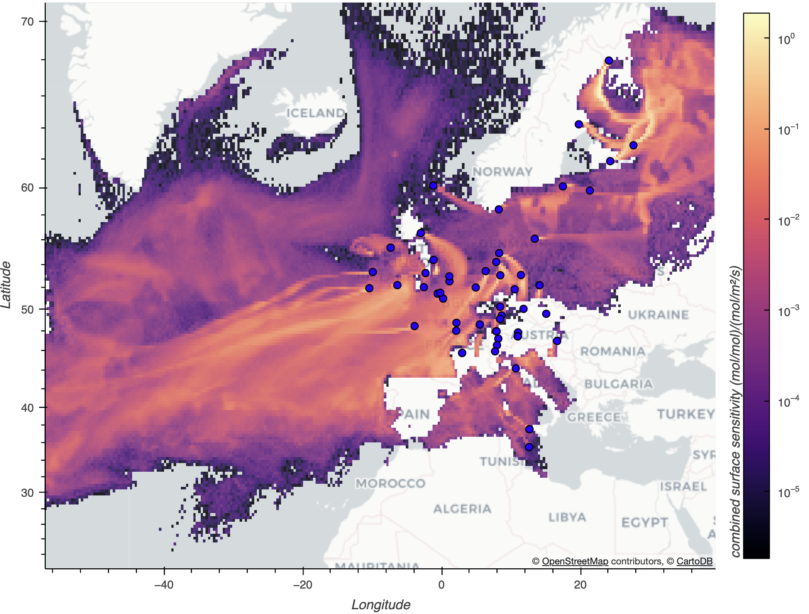

# GLIDE — GPU-accelerated Lagrangian Inversion & Dispersion Engine

A backward-in-time Lagrangian Particle Dispersion Model (LPDM) for trace-gas
footprints, written in pure PyTorch.

> **Research code, under active development, shared for input from the research
> community.** The core model is implemented and tested against analytic
> solutions, but **the physics has not been validated against other models or
> observations**. Do not use it for production inference.



*GLIDE 5-day integrated footprints for ICOS tall-tower sites in Europe, 20 January
2024. The run batched 48 hours × 56 sites (2,688 footprints) and took about 25
minutes on a single NVIDIA GH200 node.*

---

## Why this exists

An atmospheric measurement responds to surface fluxes upwind of it, and the
linear sensitivity connecting the two — the **footprint** — is what flux
inversions are built on. Computing it by running a forward model from every
candidate source is hopeless; running one *backward* simulation from the receptor
gives the whole field at once. That is what an LPDM does, and GLIDE is a backward
LPDM.

The question GLIDE was built to answer is whether such a model can be made
*scalable* and *flexible* by attacking its two traditional bottlenecks.

**Meteorology I/O.** Established LPDMs read monolithic NetCDF/GRIB files, so a
regional, time-bounded run still pages through a large archive. GLIDE streams
[analysis-ready, cloud-optimised](https://www.frontiersin.org/journals/climate/articles/10.3389/fclim.2021.782909/full)
[ERA5](https://cloud.google.com/storage/docs/public-datasets/era5) from a **Zarr
store**, fetching only the chunks a run actually touches — one hour at a time,
over the particle cloud's bounding box. The archive becomes something you sip
from rather than something you copy.

**Single-threaded CPU physics.** The hot path — trilinear interpolation of the
wind and turbulence fields, plus the elementwise Ornstein–Uhlenbeck turbulence
step — is exactly the dense, data-parallel work a GPU accelerates. The whole
engine is device-agnostic (CUDA / MPS / CPU), and on CUDA the entire per-step
body is captured as a single CUDA graph.

The aim is a model that can launch a large multi-site network in one run, grow
naturally onto larger accelerators, and adapt to new release geometries — tower
inlets today, column and satellite releases on the roadmap.

## What is in the model

| | |
| --- | --- |
| **Transport** | First-order Lagrangian stochastic model (Thomson 1987). RK2 midpoint advection; exact-OU turbulent velocity update with the full well-mixed drift and the Stohl–Thomson density correction, sign-flipped for backward integration. |
| **Vertical coordinate** | Geometric metres above ground, on a fixed terrain-following grid. Meteorology is resampled onto it once per hour and the vertical velocity is transformed into that frame. |
| **Turbulence** | Hanna (1982) in three stability regimes, aligned to FLEXPART v11; gradient-Richardson closure above the boundary layer; optional Maryon (1998) unresolved-mesoscale meander. |
| **Convection** | Reduced Emanuel & Živković-Rothman mass-flux scheme, once per meteorology window, with a non-divergent flux matrix sampled by its transpose in backward mode. |
| **Boundaries** | Smooth-wall ground reflection flipping both position and vertical velocity; constant-statistics basal layer; drop-and-count at the domain edge. |
| **Output** | Streaming 5-D Zarr footprint store `(release × time_ago × z × lat × lon)`, plus endpoint particles, diagnostics, and run metadata. |

The equations are all written out in **[docs/physics.md](docs/physics.md)**.

---

## Quick start

```bash
uv venv --python 3.11 .venv
source .venv/bin/activate
uv pip install -e .                  # core (simulation only)
.venv/bin/python -m lpdm.main --config configs/local_smoke_test.yaml
```

That runs a 3-hour backward integration against the small bundled meteorology
cube — no remote data needed. `uv` is recommended (and required ≥ 0.4.0 for the
torch wheel pin used on GPU hosts); plain `venv` + `pip install -e .` works for
CPU-only use.

Two optional extras:

- `[viz]` — `hvplot`, `geoviews`, `matplotlib`, `ipykernel`, `nbformat`, plus
  `h5netcdf`/`h5py` for the comparison notebooks. Pulls in `cartopy`, which is
  C-extension heavy; if no binary wheel exists for your cpython/OS/arch you will
  need `python3-dev` and `libgeos-dev`. Skip it on headless compute nodes.
- `[dev]` — `pytest`, `pre-commit`, `ruff`.

`scripts/setup.sh` wraps all of this:

```bash
./scripts/setup.sh --run-tests              # core + dev
./scripts/setup.sh --with-viz --run-tests   # full notebook workstation
```

---

## Running a model

Runs are driven by YAML; the schema is defined and validated in
[`src/lpdm/config.py`](src/lpdm/config.py). The CLI is intentionally tiny —
`--config <path>` plus `--device`, `--output-uri` and `--start-time` overrides,
which are the knobs that change between runs of the *same* physics config.
Everything else lives in the YAML.

```bash
.venv/bin/python -m lpdm.main --config configs/example_mhd_january.yaml \
    --device cuda --output-uri outputs/run-A --start-time 2024-01-10T00:00:00Z
```

The shipped configs form a ladder from "no external data" to "full network":

| Config | What it runs |
| --- | --- |
| `local_smoke_test.yaml` | 3 h backward against the bundled `data/sample_met.zarr`. No remote data. |
| `smoke_mhd_single_release.yaml` | One Mace Head release, 1 day backward, full physics — a quick GPU-path check before a big run. |
| `example_mhd_january.yaml` | Single `point` release on the FLEXPART-aligned grid, 24 h backward with 24 hourly time-ago bins. |
| `example_mhd_january_periodic.yaml` | 720 hourly Mace Head releases (January 2024), 5 days backward each, in one process → one 5-D `footprints.zarr`. |
| `example_multisite_january.yaml` | Several sites released together (`multi_point_periodic`). |
| `ab_multisite_perf.yaml` | A short but representative multi-site run for profiling phase shares. |

The full validation-network config (all sites × N hourly releases) is large and
machine-produced, so it is generated on demand rather than checked in:

```bash
python scripts/make_multisite_config.py --n-releases 48 -o configs/multisite_validation_48h.yaml
```

### Release geometries

The `release` block is a discriminated union on `kind`:

- `point` — a single release.
- `periodic_point` — `n_releases` evenly spaced releases from one site.
- `point_schedule` — an explicit list of release times from one site.
- `multi_point_periodic` — `n_releases` evenly spaced releases from **multiple
  sites simultaneously**.

That last one is how you scale across a network. Sites share one release
schedule, so they share meteorology windows: each fetch, each convection matrix,
each support-field build and each step's Python overhead is paid **once for all
sites** rather than once per site.

All variants produce the same output, with a flat `release` axis (one entry per
site × time) carrying `release_time`, `release_lon`, `release_lat`,
`release_alt_agl_m` and `site` coordinates. Recover a per-site cube with:

```python
fp["footprint"].set_index(release=["site", "release_time"]).unstack("release").sel(site="MHD")
```

### Config sections

`io`, `simulation`, `release`, `turbulence`, `convection`, `output_grid`,
`met_domain`, `memory`, `batch`. Validation enforces
`simulation.length_seconds > release.duration_seconds`, strictly ascending
`output_grid.z_edges_m`, and every release point lying inside `met_domain`.

Two settings deserve particular attention:

**`met_domain.vertical_levels`** sets the internal terrain-following AGL grid the
meteorology is resampled onto. **This, not the meteorology source, is the
vertical resolution the physics sees.** Give it a count (levels are geometrically
stretched from `first_layer_m` up to `alt_max_m`) or an explicit ascending list of
heights in metres; omit it for the built-in 23-level default. Raise it to exploit
a model-level source, whose fine near-surface levels the default under-uses — but
note the meteorology cache scales linearly with the level count.

**`batch.max_releases_per_batch`** controls how many releases are integrated
together in one engine pass, and it is the main memory lever. Keep it a multiple
of the site count for multi-site runs; `make_multisite_config.py` sizes it
automatically.

Memory controls live under `memory:` — `met_cache_max_hours` (set it above
`simulation.length_seconds/3600 + batch_advance_hours` or consecutive batches
re-fetch; a startup warning fires if it is too small), `met_cache_on_host`,
`met_prefetch`, the `log_every_steps`/`gc_every_steps` cadences, and optional
`guard_max_*_gib` hard limits that abort with a `MemoryError` and a diagnostic
dump rather than dying in the allocator.

### Outputs

Written under `io.output_uri`:

| File | Contents |
| --- | --- |
| `footprints.zarr` | the 5-D footprint store, streamed one batch at a time |
| `endpoint_particles.parquet` | final particle states |
| `trajectory_diagnostics.parquet` | per-run diagnostics |
| `run_metadata.json` | provenance, config echo, timings, guard report |

---

## Meteorology

GLIDE reads from a Zarr store (`io.zarr_store`). For local development, download
a cropped subset of just your area and window with
[`scripts/download_sample_cube.py`](scripts/download_sample_cube.py). Public ARCO
buckets open anonymously — no credentials needed.

**Named domain + month** — one store per month, `<DOMAIN>_<YYYYMM>.zarr` under
`--out-dir`. Domains are registered in the script's `DOMAINS` dict (today:
`EUROPE`, matching the validation grid):

```bash
.venv/bin/python scripts/download_sample_cube.py --domain EUROPE --year-month 202401
```

EUROPE at 37 pressure levels is ~80 GB/month uncompressed (~25–30 GB on disk).
Each month is a separate, resumable store.

**Ad-hoc subset** — explicit path, time window and bounds:

```bash
.venv/bin/python scripts/download_sample_cube.py \
    --out-path data/sample_met.zarr \
    --time-start 2023-12-29T18:00:00 --time-end 2024-01-01T06:00:00 \
    --lon-min -127.0 --lon-max -117.0 --lat-min 33.0 --lat-max 43.0
```

Stores are written one hour per chunk on a 128×128 horizontal tile
(`--chunk-tile`, `--chunk-levels`). GLIDE reads a bounding box, so the
domain-spanning chunks dask would otherwise choose make every read decompress the
whole domain — see
[docs/met_schema.md § Chunking](docs/met_schema.md#chunking) for the numbers and
the caveats.

**Other sources.** Any store meeting [docs/met_schema.md](docs/met_schema.md)
runs, on pressure levels or native model levels. That page's
[non-ERA5 checklist](docs/met_schema.md#preparing-meteorology-from-a-non-era5-source)
covers the gaps other NWP archives usually have to close first — absent
geopotential, coarser-than-hourly cadence, missing friction velocity, and the
heat-flux sign convention.

> The validation and comparison datasets (NAME, FLEXPART, EDGAR) are **not**
> redistributed here — see [data/README.md](data/README.md). The model runs
> end-to-end on the ERA5 smoke test without them.

---

## Tests

```bash
uv pip install --python .venv/bin/python -e ".[dev]"   # once per environment
.venv/bin/python -m pytest -q
```

298 tests, ~135 s, 90% statement coverage, no network access — all end-to-end
tests use synthetic meteorology. The suite includes analytic verification against
the Taylor dispersion curve, the OU autocorrelation function, a cell-integrated
reflected-Gaussian plume footprint, a Crank–Nicolson diffusion reference, and
terrain-following transport over a hill; plus well-mixed gates through the
production scheme and CPU-runnable guards for the CUDA-graph capture. See
[docs/VALIDATION.md](docs/VALIDATION.md).

---

## Running on GPU (Isambard AI, GH200)

The hot path runs unmodified on CUDA. The SLURM scripts in `scripts/` are tuned
for Isambard AI's Grace-Hopper nodes (aarch64, 4 × GH200 per node).

**One-time setup**, in an interactive session on a login node:

```bash
module load cudatoolkit/24.11_12.6   # provides CUDA 12.6 runtime + nvcc/ptxas
                                     # do NOT also load cuda/12.6 — they conflict
uv venv --python 3.11 .venv
uv pip install --python .venv/bin/python -e ".[dev]"

.venv/bin/python -c "import torch; print(torch.cuda.is_available(), torch.version.cuda)"
# must print: True 12.6
```

**Submitting:**

```bash
mkdir -p slurm_logs
# fill in --account and --partition in the script header first
sbatch scripts/run_periodic_cuda.slurm configs/example_multisite_january.yaml
```

Notes:

- `pyproject.toml`'s `[tool.uv.index]` + `[tool.uv.sources]` pin `torch` to the
  cu126 index on aarch64 via a platform marker; on x86 it falls back to PyPI.
  These tables are read only by `uv` — setuptools and pip ignore them. If the
  cluster moves to CUDA 12.8, update the `url`/`name` there and the module name in
  the SLURM script.
- `cudatoolkit/24.11_12.6` must be the **only** CUDA module loaded; it supersedes
  the older `cuda/12.6` and the two conflict. The SLURM script handles this.
- The script prepends PyTorch's bundled NCCL to `LD_LIBRARY_PATH` *after* all
  module loads, so the older system NCCL is not resolved first. Do not move that
  line above the module block.
- `GLIDE_PHASE_TIMERS=1` prints per-phase wall breakdowns; `GLIDE_COMPILE=0`
  skips `torch.compile` (slower, but no Triton compile cost — handy for
  debugging). See
  [docs/architecture.md § 8](docs/architecture.md#8-diagnostics-and-knobs) for the
  full list.

---

## Documentation

- **[docs/](docs/)** — the physics and engineering reference. Start with
  [docs/physics.md](docs/physics.md) for the model formulation, then
  [turbulence.md](docs/turbulence.md), [convection.md](docs/convection.md) and
  [architecture.md](docs/architecture.md). Index in
  [docs/README.md](docs/README.md).
- **[STATUS.md](STATUS.md)** — what works, what is not yet validated, what is
  next.
- **[dev/decisions/](dev/decisions/)** — the major design and physics decisions,
  each with its rationale and the rejected alternatives.
- **[AGENTS.md](AGENTS.md)** — contributor and coding-agent guide.

## Roadmap

- **Physics validation** against NAME, FLEXPART and observations. The comparison
  machinery exists (`src/lpdm/comparison.py`, the validation notebooks) but a
  systematic evaluation has not been completed. This gates everything else.
- **Native model-level meteorology.** The plumbing is in place — download, reader
  auto-detection, hydrostatic pressure reconstruction — and what remains is the
  validation re-run. ERA5's 137 hybrid levels are terrain-following by
  construction and far finer in the boundary layer (~20 levels below 1.5 km,
  lowest at ~10 m AGL, against the pressure grid's ~0/300/600 m).
- **Alternative turbulence and convection schemes**, so configurations can be
  compared and chosen per application. The interfaces exist; there is one scheme
  behind each today.
- **Column releases** — vertically distributed releases (tower inlets, aircraft
  profiles) by importance sampling over a pressure-weighted vertical PDF.
- **Satellite-style releases** — many irregular soundings per overpass, each with
  its own averaging kernel. The flat `release` axis already accommodates the
  geometry.
- **Performance** — the per-step path is no longer the wall; the remaining levers
  are meteorology I/O, convection, and the untimed per-step residual.
- **Cloud deployment** — containerised packaging returns once the architecture
  settles.

## Contributing

Bug reports, questions, physics feedback and pull requests are all welcome — see
[CONTRIBUTING.md](CONTRIBUTING.md). For larger changes, please open an issue to
discuss the approach first.

## Acknowledgements

GLIDE's turbulence and convection parameterisations follow those used in
[FLEXPART](https://www.flexpart.eu/) (GPL-3.0) as a reference, so that GLIDE's
dispersion is directly comparable to FLEXPART's. The equations were reimplemented
independently from the primary literature (Hanna 1982; Caughey 1982; Ryall &
Maryon 1998; Thomson 1987; Stohl & Thomson 1999; Emanuel & Živković-Rothman 1999;
Forster et al. 2007); **no FLEXPART source code is included in this repository.**
See [NOTICE](NOTICE).

## License

Apache License 2.0 — see [LICENSE](LICENSE) and [NOTICE](NOTICE).
